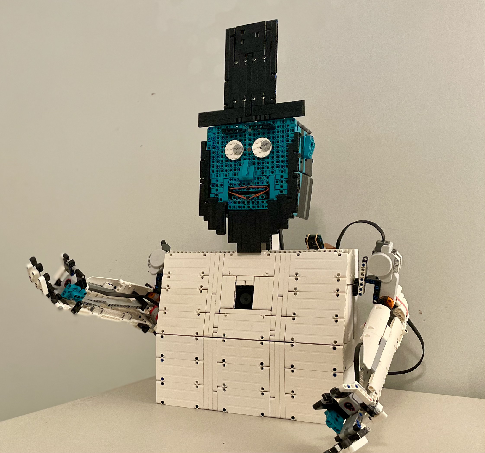

# ABE-LINCOLN-AI-LEGO-ROBOT




A customizable AI robot assistant with optional Lego Mindstorms support. This is an **ongoing prjoject**, and it is likely you may encounter bugs. This code includes Gemini-powered conversations, voice input, face and hand tracking, a control center, Rock Paper Scissors, camera support, web searches, along with many other features.

## IMPORTANT
Abe is an ongoing project, so there ***still may be bugs that need to be fixed***. It is recommended *not* to use the Lego robot until the code better supports it. This code was **designed and debugged on a Raspberry Pi 5** running Bookworm, and ***hasn't*** been tested on other operating systems. For example, `picamera2` is a Python module made for Raspberry Pi. While the code is structured to work without it if you aren't using a Pi camera, compatibility is not fully guaranteed.

## Table of contents

- [IMPORTANT](#important)
- [Features](#features)
- [Inspiration](#inspiration)
- [Installation](#installation)
- [Usage](#usage)
- [License](#license)
- [Safety](#safety)
- [Disclaimer](#disclaimer)

## Features

- Connect up to 2 cameras
- Optional conversation saving
- Optional live camera previews
- Control center window 
- Play Rock Paper Scissors

## Inspiration
This project was inspired by CreativeMindstorm's Lego AI Dave Head. You should also check out CreativeMindstorm's [Lego AI Dave Head Code](https://github.com/CreativeMindstorms/AI-LEGO-HEAD)!


## Installation
### Requirements:
- Python 3 (Tested on 3.11)
- Python editor (Tested in VSCode, optional but recommended)
- Speaker
- Microphone
- Up to 2 cameras (optional)

### Installation
1. Clone this repository with git:
```bash
  git clone https://github.com/L-Magic-Code/ABE-LINCOLN-AI-LEGO-ROBOT.git
```
2. Install the required packages listed in requirements.txt:
```bash
cd ABE-LINCOLN-AI-LEGO-ROBOT
pip install -r requirements.txt
```

Next, if you are using a Raspberry Pi:
```bash
pip install picamera2==0.3.31
```

<details>
<summary> <strong> If you get "error: externally-managed-environment" </strong> </summary>
For requirements.txt:

```bash
pip install -r requirements.txt --break-system-packages
```
For picamera2: 
```bash
pip install picamera2==0.3.31 --break-system-packages
```
</details>
<br>


3. Look through each of the 4 config files and change settings if needed
4. Export your Gemini API key so the code can access it:
```bash
export GEMINI_API_KEY="YOUR_API_KEY_HERE"
```
5. Download a vosk model [*here*](https://alphacephei.com/vosk/models)
6. Unzip the vosk model, and rename the folder exactly: **"vosk-model"**
7. Move the vosk-model folder to External_Files in the project folder
8. Open the project in your Python editor and run *first_time_setup.py*. You won't need to run it again.


***Optional:***
Customize the ai_prompt.txt file to give the robot a more unique personality

## Usage
1. Open the project in your Python editor and run *main.py*

If you are using the microphone:

2. Wait for the terminal to output: "Say Hey Abraham Lincoln"

3. Say one of the keywords in mic_config

4. You can now **start talking to Abe!**

5. Abe will start waiting for the keywords again after the specified listening_timeout in mic_config

6. Say 'shut down' to end the code

* Note that you cannot type to Abe if you are using the mic, but you can switch the prompt input mode through the control center

If you are *not* using the microphone:

2. Wait for the control center window to open and load

3. You can now **start typing to Abe!**

4. Type 'shut down' to end the code


## Disclaimer
Abe is an ongoing project, and a personal hobby. While feedback, errors, and suggestions are greatly appreciated, ***I am unable to provide personal assistance*** for this project.

## License
This project is licensed under the [GPLv3 License](LICENSE). Contributions and modifications are welcome, but they must remain open-source and credit the original author.

## Safety
When using this code:
- Never expose your API key
- Never enter personal info like passwords into Gemini
- This chatbot is AI, and can make mistakes